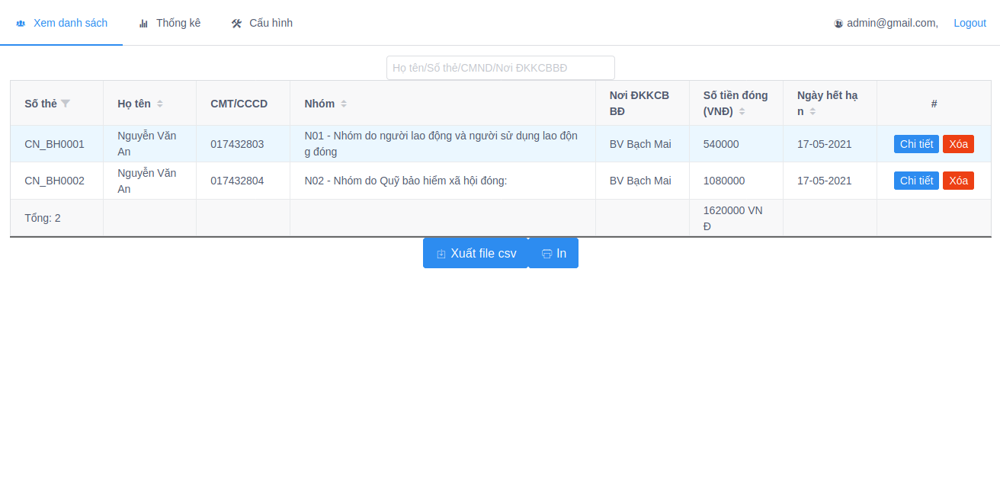
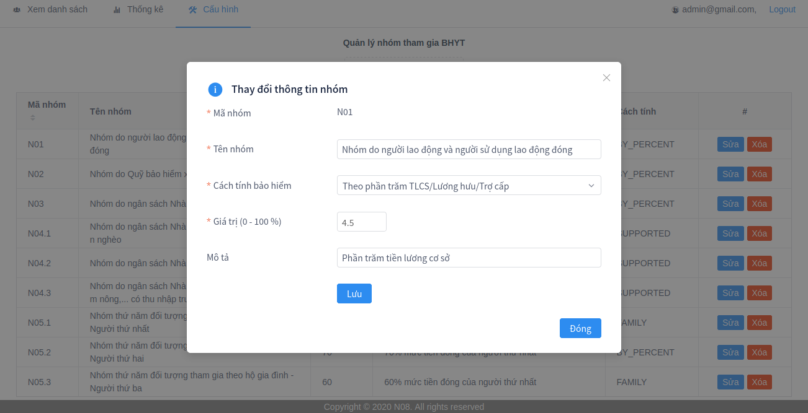

# bhyt
##### [PTIT] Bài tập lớn Đảm bảo chất lượng phần mềm cô Ngọc

Nhóm 8: Bảo hiểm y tế - Xem danh sách, cài đặt, cấu hình
#### Front End: Vue js
1. Install project
```shell script
cd front-end-byht
yarn install
yarn serve
```
u/p: admin@gmail.com/123456





#### Back End: Spring boot
```shell script
1. Create and import database from bhyt.sql
2. mvn spring-boot:run
```
#### Nhận xét
Ít testcase, chưa căn lề đúng cho dữ liệu trong bảng
